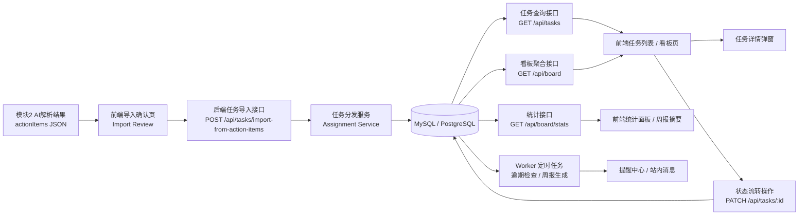
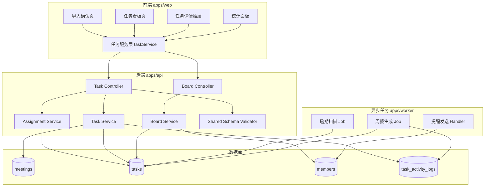
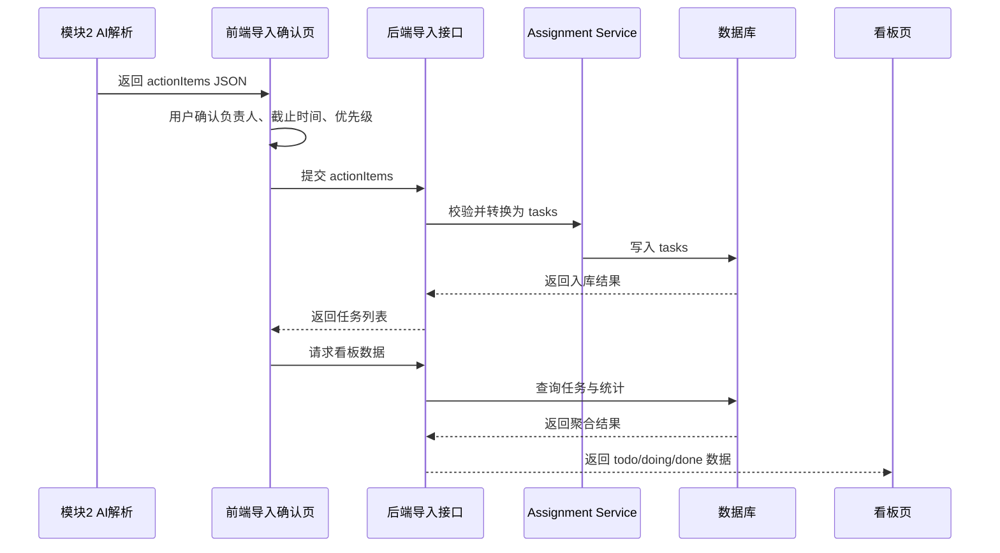
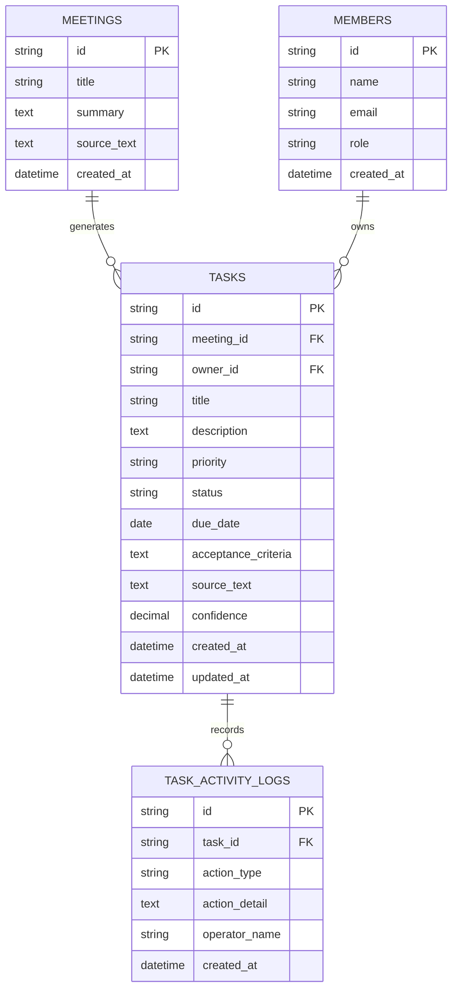

# 模块 3-4 前后端与数据库框架图

本文档聚焦 A 组当前负责的两部分能力：

- 模块 3：自动化任务分发系统
- 模块 4：极简可视化看板

这里默认模块 2 已经输出统一的数据结构 `actionItems`，模块 3 和模块 4 围绕这份结构化数据继续完成任务生成、落库、展示和流转。

## 1. 总体职责划分

### 前端 Web

- 导入确认页：确认 AI 提取出的行动项
- 看板页：按状态展示任务
- 任务详情页：展示描述、验收标准、来源语句、截止时间
- 统计面板：展示总任务数、逾期任务数、完成率等

### 后端 API

- 接收 `actionItems`
- 将 `actionItems` 转换为内部 `tasks`
- 提供任务增删改查接口
- 提供看板聚合与统计接口
- 为后续提醒、周报等能力预留扩展点

### 数据库

- 持久化会议、任务、成员、任务操作记录
- 支撑看板查询、状态流转和统计分析

## 2. 前后端总体框架图



## 3. 模块分层图



## 4. 数据流图



## 5. 数据库实体关系图



## 6. 你负责的 3-4 模块具体落点

### 模块 3：自动化任务分发系统

你要负责的核心不是“提醒插件”，而是把 `actionItems` 稳定转成系统任务：

- 接收模块 2 的结构化输出
- 提供任务导入确认页
- 提供任务导入接口
- 完成 `actionItems -> tasks` 字段映射
- 保存任务到数据库
- 支持修改负责人、截止时间、优先级和状态

对应代码落点建议：

- `apps/web/src/features/task/import-review`
- `apps/api/src/modules/task`
- `apps/api/src/modules/assignment`

### 模块 4：极简可视化看板

你要负责的是让任务可以被看见、被管理、被追踪：

- 三列看板 To Do / Doing / Done
- 任务详情抽屉
- 状态流转
- 顶部统计区
- 简版周报摘要

对应代码落点建议：

- `apps/web/src/features/board`
- `apps/web/src/features/task`
- `apps/api/src/modules/board`

## 7. 最小接口清单

建议优先实现这 4 个接口：

```text
POST   /api/tasks/import-from-action-items
GET    /api/tasks
PATCH  /api/tasks/:id
GET    /api/board
```

如果时间允许，再补：

```text
GET    /api/board/stats
GET    /api/tasks/:id
```

## 8. 最小数据库表

本周最小可行版本建议先建 4 张表：

- `meetings`：记录会议摘要和来源文本
- `tasks`：记录任务核心信息
- `members`：记录负责人信息
- `task_activity_logs`：记录状态变更和编辑操作

如果时间紧，可以先只建：

- `tasks`
- `members`

但从答辩和演示完整度考虑，建议把 `meetings` 也加上，这样“任务来源于哪次会议”就能讲完整。

## 9. 当前最推荐的开发顺序

1. 先固定 `actionItems` 数据结构。
2. 先做任务导入接口和 `tasks` 表。
3. 再做看板查询接口和看板页。
4. 最后补统计面板和简版周报摘要。

这样做的原因很直接：

- 任务先落库，系统骨架就立住了。
- 看板是最容易展示价值的页面。
- 统计和周报属于加分项，适合最后补。