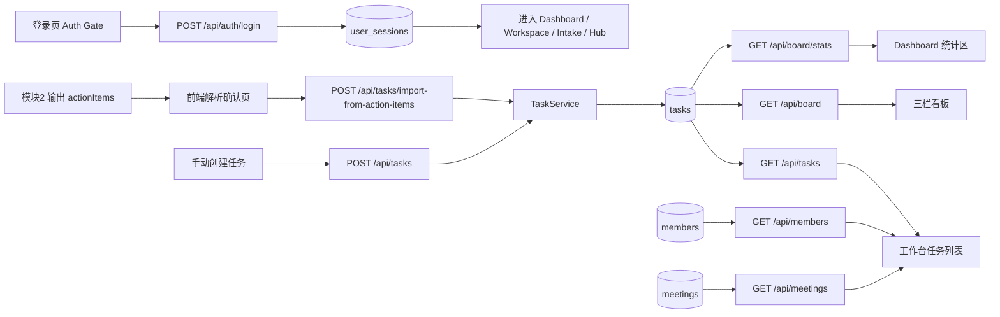
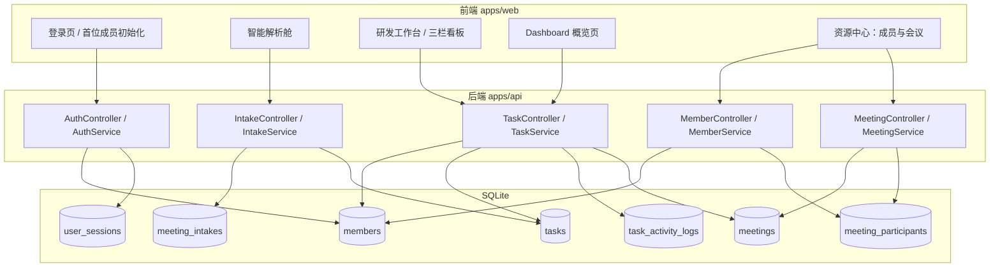
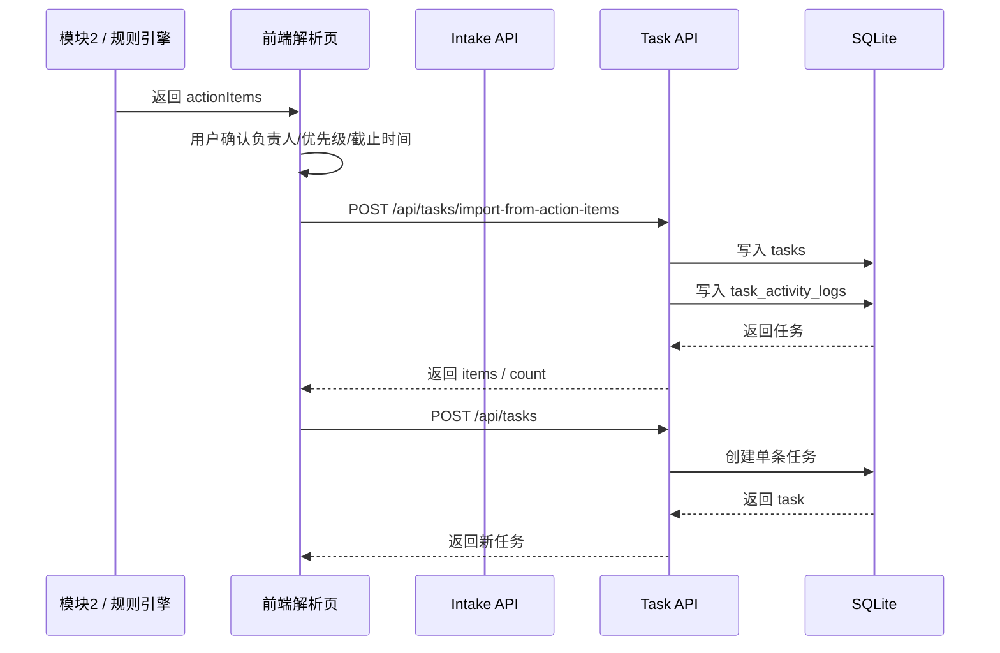
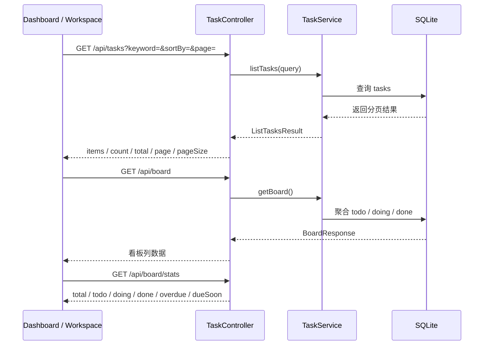
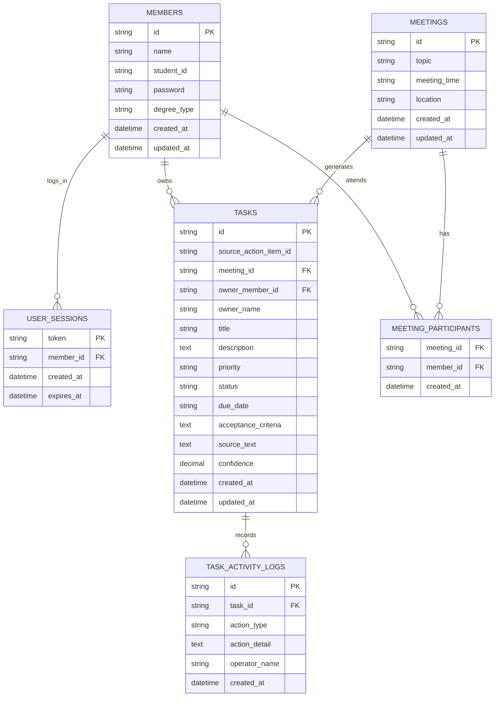

# 模块 3-4 前后端与数据库框架图（当前代码版）

本文档聚焦 A 组负责的两部分：

- 模块 3：自动化任务分发系统
- 模块 4：极简可视化看板

与旧版草图不同，本文档只描述当前仓库里已经落地的真实结构，不再使用假设中的 `Assignment Service`、`Board Controller` 等未实现组件。

## 1. 当前职责边界

### 模块 3：自动化任务分发系统

当前已实现内容：

- 接收模块 2 输出的 `actionItems`
- 支持在前端解析页确认后导入任务
- 支持直接手动创建任务
- 支持将任务写入 SQLite，并记录任务活动日志
- 支持负责人、截止时间、优先级、状态更新

当前实际代码落点：

- 前端：`apps/web/index.html`、`apps/web/src/main.ts`
- 后端：`apps/api/src/modules/task`
- 与解析链路衔接：`apps/api/src/modules/intake`

### 模块 4：极简可视化看板

当前已实现内容：

- 三栏看板 To Do / Doing / Done
- 看板统计接口与统计展示
- 风险、负责人、状态过滤
- 任务详情抽屉与工作台编辑
- Dashboard 概览卡片和近期任务入口

当前实际代码落点：

- 前端：`apps/web/index.html`、`apps/web/src/main.ts`、`apps/web/src/styles.css`
- 后端：同一套 `TaskController + TaskService` 对外提供任务与看板数据

## 2. 总体框架图



## 3. 当前分层结构



## 4. 模块 3 当前数据流



## 5. 模块 4 当前展示流



## 6. 数据库实体关系图



## 7. 当前关键接口

### 认证与入口

```text
POST /api/auth/login
POST /api/auth/logout
GET  /api/users/me
GET  /api/members/status
```

### 模块 3 关键接口

```text
POST /api/meeting-intakes/parse
POST /api/meeting-intakes/:id/import-to-board
POST /api/tasks
POST /api/tasks/import-from-action-items
PATCH /api/tasks/:id
GET  /api/tasks/:id/activity
```

### 模块 4 关键接口

```text
GET /api/tasks
GET /api/tasks/:id
GET /api/board
GET /api/board/stats
```

## 8. 当前版本的真实边界

- 当前登录模型已经落地，但仍是本地轻量账号体系
- 登录用户名当前使用成员姓名，`studentId` 已入库但暂未作为登录主键
- `owner_member_id` 已进入任务模型，但 `owner_name` 文本回退仍在保留
- `apps/worker` 目录仍然预留，提醒、周报、异步同步尚未实现
- 当前没有正式自动化测试体系

## 9. 下一阶段建议顺序

1. 完成角色 / 权限边界细化
2. 统一成员账号文案与登录标识（姓名 / studentId）
3. 增加前端分页、批量操作、归档视图
4. 落地 Worker 提醒与汇总能力
5. 补齐自动化测试

1. 补后端数据约束与错误码规范（成员同名、输入校验）。
2. 补任务搜索/排序/手动创建。
3. 推进看板过滤后端下推。
4. 最后补周报与提醒等加分项。

这样做的原因很直接：

- 任务先落库，系统骨架就立住了。
- 看板是最容易展示价值的页面。
- 统计和周报属于加分项，适合最后补。